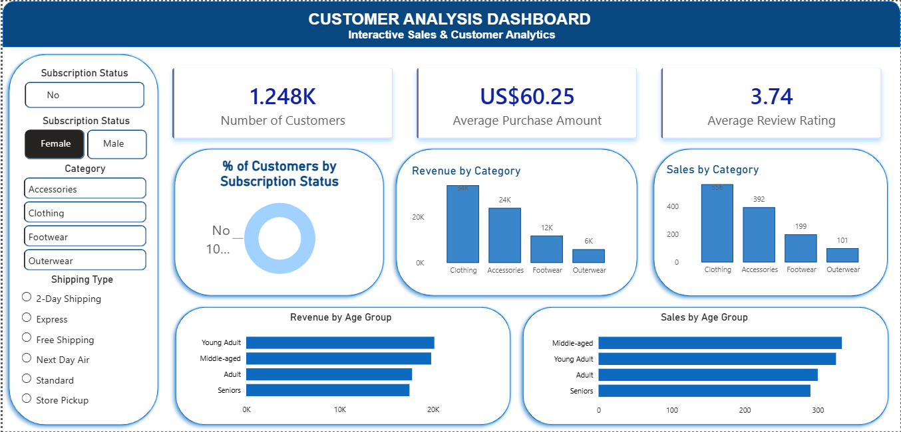
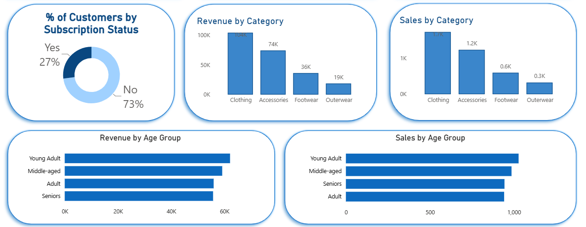
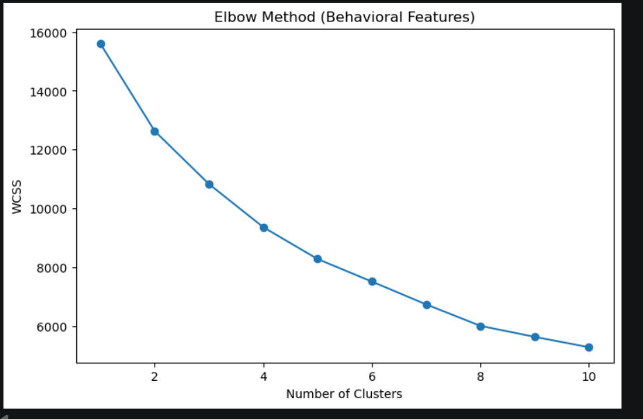
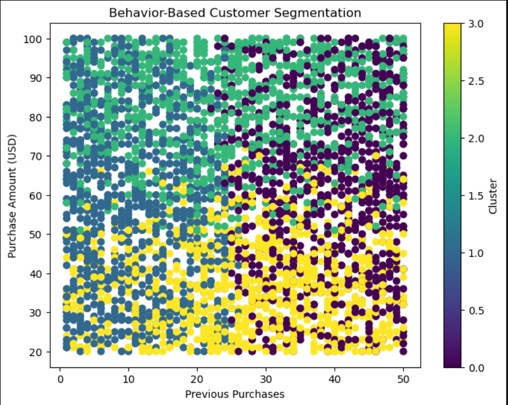
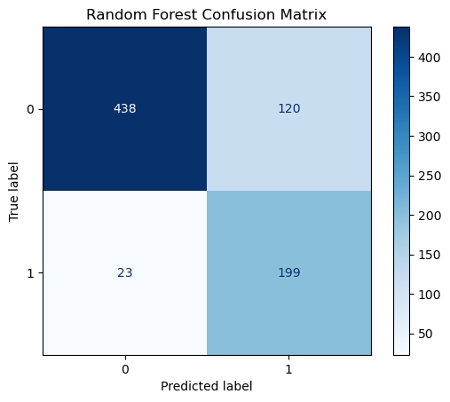
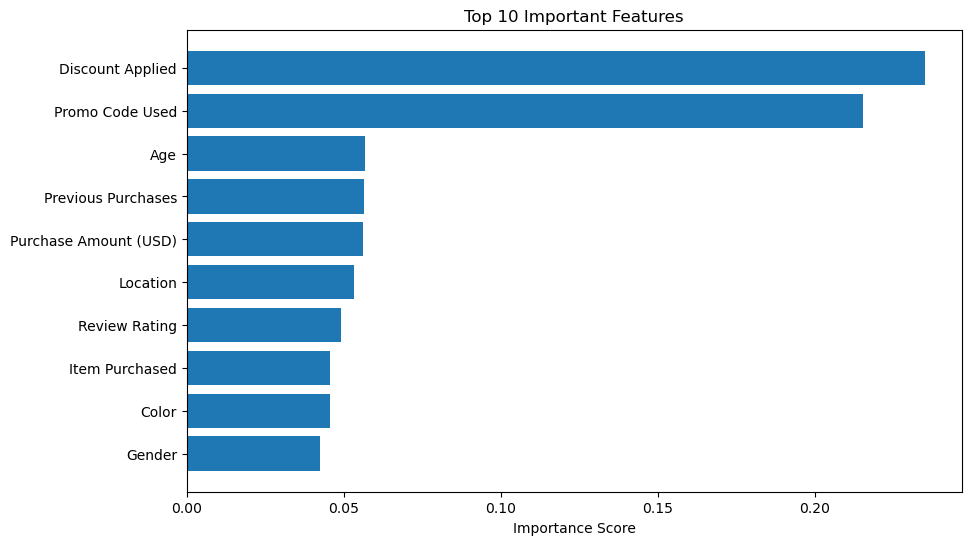
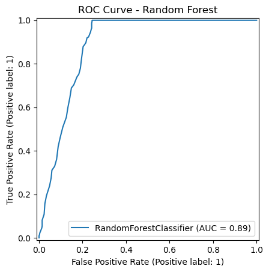

# 🛍️ Customer Shopping Analysis

## 📌 Project Overview

An end-to-end data analytics and machine learning project that analyzes customer shopping behavior using **Python, SQL, MySQL, Power BI, and Scikit-Learn**. The project demonstrates the complete analytics workflow—from data cleaning and SQL analysis to interactive dashboards and customer segmentation.

---

## 🎯 Objectives

- Clean and preprocess customer shopping data
- Perform exploratory data analysis (EDA)
- Conduct business analysis using SQL
- Build an interactive Power BI dashboard
- Segment customers using Machine Learning (K-Means Clustering)


---

## 🛠️ Tools & Technologies

- Python
- Pandas
- NumPy
- Matplotlib
- Scikit-learn
- MySQL
- SQL
- Power BI
- Git
- GitHub


---

## 📂 Dataset

The dataset contains customer shopping information, including:

- Customer ID
- Age
- Gender
- Category
- Purchase Amount
- Review Rating
- Subscription Status
- Shipping Type
- Payment Method
- Discount Applied
- Previous Purchases
- Frequency of Purchases
- Season

---

## 🔄 Project Workflow

```text
Raw Customer Shopping Dataset
            │
            ▼
Python Data Cleaning & Feature Engineering
            │
            ▼
MySQL Database
            │
            ▼
Business Analysis using SQL
            │
            ▼
Interactive Power BI Dashboard
            │
            ▼
Machine Learning
   ├── Customer Segmentation (K-Means)
   └── Subscription Prediction (Random Forest)
```


---

# 🐍 Python

Performed:

- Missing value treatment
- Feature engineering
- Data cleaning
- Column standardization
- Age group creation
- Purchase frequency mapping
- Exploratory Data Analysis

---

# 🗄️ SQL Analysis

Business questions answered include:

- Total revenue by gender
- High-value customers using discounts
- Average review ratings by category
- Shipping type analysis
- Subscription analysis
- Seasonal purchasing trends
- Revenue by customer demographics

---

# 📈 Power BI Dashboard

The dashboard includes:

- Total Revenue
- Customer Overview
- Revenue by Category
- Revenue by Gender
- Revenue by Season
- Payment Method Analysis
- Subscription Analysis
- Interactive Filters

> 📷 Dashboard screenshots are available below.


## 📊 Dashboard Preview


---

## 🎛️ Interactive Dashboard

Users can filter the dashboard by Category, Gender, Season, and Subscription Status. 
(Shown here: Gender filtered as female)



---

## 💰 Revenue Analysis

The dashboard provides revenue insights across customer segments and product categories.



# 🤖 Machine Learning

## Customer Segmentation

Algorithm Used:

- K-Means Clustering

### Features Used

- Age
- Purchase Amount (USD)
- Previous Purchases
- Review Rating

### Customer Segments

| Segment | Description |
|---------|-------------|
| Young Loyal Customers | Younger customers with higher spending and frequent purchases |
| New Customers | Younger customers with fewer previous purchases |
| Premium Senior Customers | Older customers with the highest purchase amounts |
| Budget Senior Customers | Older customers with lower spending patterns |

---
# 📈 Customer Segmentation

## Elbow Method



## Customer Segments



## 2️⃣ Subscription Prediction

### Models Compared

| Model | Accuracy |
|--------|---------:|
| Decision Tree | **79.87%** |
| Random Forest | **81.67%** |


### Final Model

✅ **Random Forest Classifier**

### Model Performance

- Accuracy: **81.67%**
- Subscriber Recall: **90%**
- Subscriber F1-Score: **0.74**



### Random Forest Feature Importance

Random Forest outperformed the Decision Tree and was selected as the final model for predicting customer subscription status.




---
# 📁 Repository Structure

```text
Customer-Shopping-Analysis/
│
├── Customer_Shopping_Analysis.ipynb
├── Customer_Segmentation.ipynb
├── Subscription_Prediction.ipynb
├── Customer_Shopping_Analysis.sql
├── Customer Shopping Analysis.pbix
├── customer_shopping_behavior.csv
├── images/
└── README.md
```


---

# 🚀 Future Improvements

- Deploy the project as a Streamlit web application
- Compare additional clustering algorithms (Hierarchical Clustering, DBSCAN)
- Use a real-world retail dataset for customer segmentation
- Build an automated data pipeline for periodic data updates
- Perform hyperparameter tuning to further improve model performance


---
# 🎯 Key Skills Demonstrated

- Data Cleaning & Preprocessing
- Exploratory Data Analysis (EDA)
- SQL Query Writing
- MySQL Database Management
- Business Intelligence with Power BI
- Customer Segmentation
- Classification Models
- Model Evaluation
- Data Visualization
- Git Version Control

---

# 👩‍💻 Author

**Avni Jain**

GitHub: https://github.com/avnijainnnn