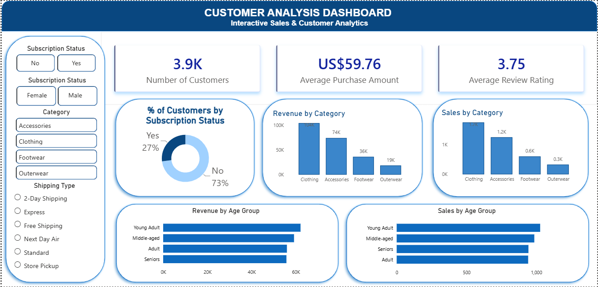

# 🛍️ Customer Shopping Analysis

## 📌 Project Overview

This project analyzes customer shopping behavior using Python, MySQL, SQL, and Power BI. The objective is to clean, transform, analyze, and visualize customer purchase data to uncover meaningful business insights and demonstrate an end-to-end data analytics workflow.

---

## 🎯 Objectives

- Clean and preprocess customer shopping data
- Perform exploratory data analysis (EDA)
- Engineer new features for better analysis
- Store cleaned data in MySQL
- Solve business problems using SQL
- Build an interactive Power BI dashboard
- (Upcoming) Develop machine learning models for customer insights

---

## 🛠️ Tools & Technologies

- Python
- Pandas
- NumPy
- MySQL
- SQL
- SQLAlchemy
- PyMySQL
- Power BI
- Git & GitHub

---

## 📂 Dataset

The dataset contains customer shopping information, including:

- Customer ID
- Age
- Gender
- Category
- Purchase Amount
- Review Rating
- Subscription Status
- Shipping Type
- Payment Method
- Discount Applied
- Previous Purchases
- Frequency of Purchases
- Season

---

## 🔄 Project Workflow

```
Customer Shopping Dataset
            │
            ▼
Python Data Cleaning & Feature Engineering
            │
            ▼
MySQL Database
            │
            ▼
Business Analysis using SQL
            │
            ▼
Interactive Power BI Dashboard
            │
            ▼
Machine Learning (Coming Soon)
```

---

## 📊 Business Questions Answered

- Total revenue generated by male vs female customers
- Customers spending above average despite discounts
- Top-rated product categories
- Comparison of shipping methods
- Subscription revenue analysis
- Discount effectiveness
- Customer segmentation
- Most purchased products
- Repeat customer behavior
- Revenue contribution by age groups

---

## 📁 Repository Structure

```
Customer-Shopping-Analysis
│
├── customer_shopping_behavior.csv
├── Customer_Shopping_analysis.ipynb
├── Customer_Shopping_analysis.sql
├── Customer Shopping Analysis.pbix
└── README.md
```

---

## 📈 Power BI Dashboard

Dashboard includes:

- Revenue Overview
- Customer Demographics
- Category Performance
- Subscription Analysis
- Payment Method Analysis
- Seasonal Trends
- Interactive Filters

## 📊 Dashboard Preview



---

## 🚀 Future Improvements

- Machine Learning models
- Customer Segmentation
- Spending Prediction
- Recommendation System
- Advanced Power BI Dashboard

---

## Author

**Avni Jain**

GitHub: https://github.com/avnijainnnn
